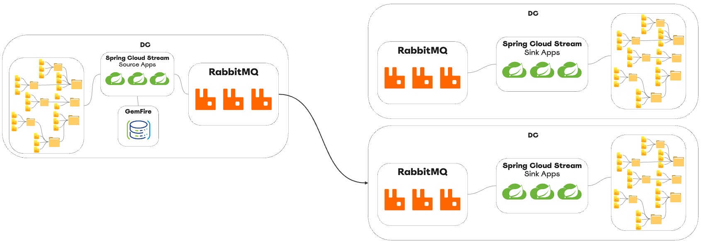

# Spring File Service

This project was developed to demonstrate file movement and integration
 using [VMware Data Solutions](https://www.vmware.com/solutions/data-solutions.html) and [Spring](https://spring.io/)

- High throughput file streaming
- Multi-site replication (hub-spoke) 
- Distribution of millions of small files
- Maintain file source directory structure 
- Low-latency file data transfers


# Architecture



## RabbitMQ

### High throughput file streaming

[RabbitMQ](https://www.rabbitmq.com/) supports moving a large number of small files.
The [file-consumer-sink](https://github.com/ggreen/spring-file-service/tree/main/applications/file-consumer-sink) application supports the [RabbitMQ streaming](https://www.rabbitmq.com/stream.html) that has [benchmarks to support the throughput of millions messages](https://tanzu.vmware.com/content/blog/rabbitmq-event-streaming-broker) per second.

### Multi-site replication (hub-spoke)

RabbitMQ features such as [exchanges](https://www.rabbitmq.com/tutorials/amqp-concepts.html#exchanges), [routing with binding rules](https://www.rabbitmq.com/tutorials/tutorial-one-spring-amqp.html), site replication ([shovel](https://www.rabbitmq.com/shovel.html) and [federation](https://www.rabbitmq.com/federation.html)) make it a great solution for implementing hub and spoke integration patterns. RabbitMQ decouples producer and consumer applications. The application can be running on the same network or distributed over a Wide Area Network (WAN). This allows for better maintainability and extensibility compared to disk-based replication.

### Distribution of millions of small files

RabbitMQ supports high availability and fault tolerance for messaging.
Rabbit can be set up as a cluster within a single network. Outages to one or more RabbitMQ servers can be transparent to producer and consumer applications. 

In general, messages utilize memory, disk, and network resources. In RabbitMQ (ex: version RabbitMQ 11) the default max size if 134 MB. The messages should be less than maximum allowed size of 512 MB. See [RabbitMQ configuration](https://www.rabbitmq.com/configure.html). 

### Maintain file source directory structure

The [file-send-source](https://github.com/ggreen/spring-file-service/tree/main/applications/file-send-source) application  implementation adds the file attributes to each message. This includes absolute path, relative path, in addition to the file content. The application sends messages to an RabbitMQ exchange that allows for future custom routing logic.


### Low-latency file data transfers

RabbitMQ supports [low-latency event streaming](https://www.linkedin.com/learning/achieving-low-latency-data-with-edge-computing/rabbitmq?autoplay=true&resume=false).
It uses a push-based model from producers to consumers.  

The file-consumer-sink saves meta-data to remember files sent to RabbitMQ.
It uses [GemFire](https://www.vmware.com/products/gemfire.html) (based on [Apache Geode](https://www.linkedin.com/learning/achieving-low-latency-data-with-edge-computing/apache-geode?autoplay=true&resume=false)).
GemFire is an In-memory SQL-database. It provides high-performance real-time apps with ultra-high speed, in-memory data and compute grid data processing.


-----

# Operations

## File Consumer Sink

The [file-consumer-sink](https://github.com/ggreen/spring-file-service/tree/main/applications/file-consumer-sink) application uses [RabbitMQ streams](https://www.rabbitmq.com/streams.html) to save file content from Rabbit to a local directory. 

**Application Properties**

| Properties               | Notes                        | Default |
|--------------------------|------------------------------|---------
| spring.rabbitmq.host     | Rabbit host connection       |         |
| spring.rabbitmq.username | Rabbit username              | guest   |
| spring.rabbitmq.password | Rabbit password              | guest   |
| spring.rabbitmq.port     | Rabbit port                  | 5672    |
| file.sink.rootDirectory  | Root directory to save files |         |


### Run file-consumer-sink

```shell
java -jar applications/file-consumer-sink/build/libs/file-consumer-sink-0.0.1-SNAPSHOT.jar --spring.rabbitmq.host=localhost --file.sink.rootDirectory=/tmp/io/output
```


### Send File Source

The Send File Source using the [Nyla Solutions](https://github.com/nyla-solutions) library [FileMonitor](https://github.com/nyla-solutions/nyla#filemonitor)
to watch files in given a root source directory. 

New or updated files will be sent to [RabbitMQ exchange](https://www.rabbitmq.com/tutorials/amqp-concepts.html).

#### GemFire

The application stores meta-data about which files have been sent
with an embedded [GemFire server](https://docs.spring.io/spring-data/geode/docs/current/reference/html/#bootstrap-annotation-config-geode-applications) 
within the [Spring Boot](https://spring.io/projects/spring-boot) application using the [@CacheServerApplication](https://docs.spring.io/spring-data/geode/docs/current/api/org/springframework/data/gemfire/config/annotation/CacheServerApplication.html) annotation uses
 [Spring Data for GemFire](https://docs.vmware.com/en/Spring-Data-for-VMware-GemFire/index.html). The data is stored in a [GemFire region](https://docs.vmware.com/en/VMware-GemFire/9.15/gf/basic_config-data_regions-chapter_overview.html) named "**File**".


**Application Properties**

| Properties                                        | Notes                                               | Default |
|---------------------------------------------------|-----------------------------------------------------|---------|
| spring.rabbitmq.host                              | Rabbit host connection                              |         |
| spring.rabbitmq.username                          | Rabbit username                                     | guest   |
| spring.rabbitmq.password                          | Rabbit password                                     | guest   |
| spring.rabbitmq.port                              | Rabbit port                                         | 5672    |
| spring.data.gemfire.locators                      | GemFire locator (only needed to inspect meta-data)  |         |
| file.source.rootDirectory                         | Root directory to watch for file changes            |         |
| file.source.pollingIntervalMs                     | Milliseconds rate to poll for file changes          | 1000    |
| file.source.delayMs                               | The delay between polling interval to monitor files | 1000    |
| file.source.fileNameFilter                        | File name pattern to process under the root dir     | *       |
| file.source.processCurrentFiles                   | Boolean to process current files at startup         | true    |
| spring.data.gemfire.disk.store.directory.location | Directory to store GemFire file meta-data           |         |


## Run file-send-source 

```shell
java -jar applications/file-send-source/build/libs/file-send-source-0.0.1-SNAPSHOT.jar --spring.data.gemfire.disk.store.directory.location=/Users/Projects/solutions/integration/files/dev/spring-file-service/deployment/gemfire/work-dir --spring.rabbitmq.host=localhost --file.source.rootDirectory=/tmp/io/input/
```

If you would like to connect the File Send Source to a GemFire Locator, then add the following (note the following was tested on Java SDK version 17):

Start GemFire [locator](https://docs.vmware.com/en/VMware-GemFire/9.15/gf/configuring-running-running_the_locator.html) using [Gfsh](https://docs.vmware.com/en/VMware-GemFire/9.15/gf/tools_modules-gfsh-quick_ref_commands_by_area.html)

```shell
$GEMFIRE_HOME/bin/gfsh -e "start locator --name=locator"
```

*Adding JVM --add-opens --add-exports, and spring.data.gemfire.locators arguments*

```shell
java   --add-opens java.base/java.lang=ALL-UNNAMED --add-opens java.base/java.util=ALL-UNNAMED --add-exports  java.management/com.sun.jmx.remote.security=ALL-UNNAMED --add-exports  java.base/sun.nio.ch=ALL-UNNAMED -jar applications/file-send-source/build/libs/file-send-source-0.0.1-SNAPSHOT.jar --spring.data.gemfire.disk.store.directory.location=/Users/Projects/solutions/integration/files/dev/spring-file-service/deployment/gemfire/work-dir --spring.rabbitmq.host=localhost --file.source.rootDirectory=/tmp/io/input/ --spring.data.gemfire.locators="localhost[10334]"
```

**List Files in GemFire**

- query=select * from /File

```shell
$GEMFIRE_HOME/bin/gfsh -e "connect --locator=localhost[10334]" -e "--query='select * from /File' "
```

Example output


```shell

/Users/devtools/repositories/IMDG/gemfire/vmware-gemfire-9.15.4/bin$ ./gfsh -e "connect --locator=localhost[10334]" -e "query --query='select * from /File' "

(1) Executing - connect --locator=localhost[10334]

Connecting to Locator at [host=localhost, port=10334] ..
Connecting to Manager at [host=192.168.86.201, port=1099] ..
Successfully connected to: [host=192.168.86.201, port=1099]

You are connected to a cluster of version 9.15.4.


(2) Executing - query --query='select * from /File'

Result : true
Limit  : 100
Rows   : 13

              absolutePath               | lastModified
---------------------------------------- | -------------
"/tmp/io/input/test3.txt"                | 1680878671420
"/tmp/io/input/heat/test1.txt"           | 1680871569198
"/tmp/io/input/e-receipt3.pdf"           | 1680878671420
"/tmp/io/input/heat/e-receipt.pdf"       | 1680871569197
"/tmp/io/input/heat/out.txt"             | 1680871569198
"/tmp/io/input/heat/test.txt"            | 1680871569198
"/tmp/io/input/e-receipt-2.pdf"          | 1680878671420
"/tmp/io/input/BACKUPDEFAULT_1.crf"      | 1680990244749
"/tmp/io/input/test.txt"                 | 1680878671420
"/tmp/io/input/heat/test3.txt"           | 1680871569198
"/tmp/io/input/e-receipt4.pdf"           | 1680878671420
"/tmp/io/input/heat/test2.txt"           | 1680871579502
"/tmp/io/input/e-receipt.pdf"            | 1680878671420
```

# Building

This project using GemFire commercial edition.
See the following to

[Obtain GemFire libraries from a Maven Repository](https://docs.vmware.com/en/VMware-GemFire/9.15/gf/getting_started-installation-obtain_gemfire_maven.html).

